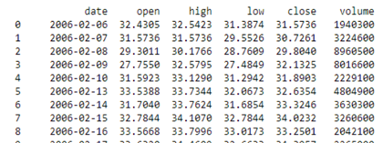
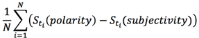
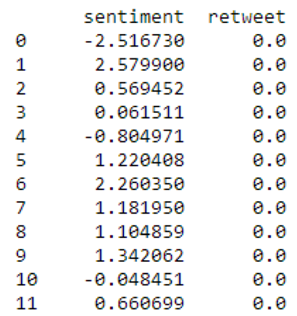
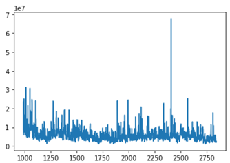
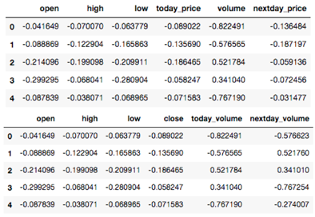
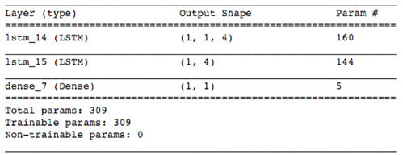
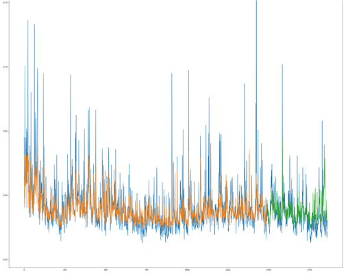
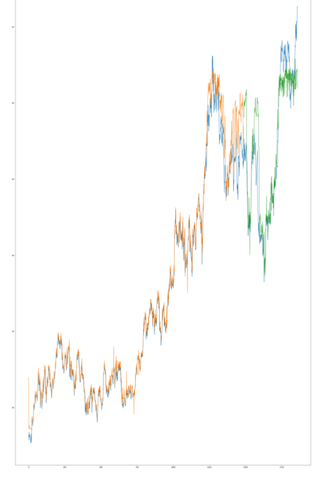

Datascience course - Final project: Analytic, predict UAL Stock price with twitter sentiment analysis.

### Dataset 	

Bộ dữ liệu lịch sử stock sử dụng cho bài toán được lấy từ MacroTrends Data Download.

Với Twitter data, nhằm để vượt qua những hạn chế của Twitter Offical API,  ta sử dụng một dự án của Jefferson-Henrique, cho phép chúng ta có thể lấy được tweet từ bất cứ thời điểm nào.

Tiếp theo, ta sử dụng Textblob, một dự án dùng để đánh giá mức độ ngữ nghĩa của văn bản để tiến hành phân tích và tính điểm cho các tweet. Sau khi đã có toàn bộ danh sác các tweet, tiến hành sử dụng thư viện Textblob để phân tích ngữ nghĩa. 

Đồng thời, số lượng retweet cũng là điều cũng được chú ý đến. Cuối cùng, dữ liệu của sentiment được chuẩn hóa bằng z-score. Để giảm bớt số chiều, ta áp dụng phép làm trơn laplace vào các retweet, sau đó nhân vào chỉ số sentiment do ảnh hưởng của retweet thể hiện độ phổ biến của ý kiến.

Dữ liệu Twitter sau khi được xử lý:

##### Một vài đánh giá:

Sau khi thống kê các dữ liệu liên quan, ta nhận ra một số điều thú vị. Chẳng hạn như giá cả chứng khoán thay đổi khá là bất ổn. Sau khi tiến hành mô phỏng dữ liệu, ta có thể dễ dàng thấy rõ những điểm bất thường trong dữ liệu, như là những khoảng thời gian mà giá cả của công ty đạt mức thấp nhất (thường là vào mùa đông), hay là cao nhất (thời gian UAL bắt đầu thay đổi CEO). Tất cả những điều này đều liên hệ đến cảm xúc người dùng, nhất là khi mà những sự kiện lớn diễn ra đối với công ty cũng ảnh hưởng đến cảm xúc. Bằng cách nắm bắt được tâm trạng của người dùng thông qua twitter, nó giúp ta nắm được tình hình thế giới, và có thể tìm các nào đó dự đoán thông qua ngữ nghĩa.

*Ta có thể dễ dàng nhận thấy rằng có một số thời điểm luôn cao (các đợt du lịch vào mùa hè) hay là*
*luôn thấp (mùa đông khi việc đi lại hạn chế). Tuy nhiên vẫn có những thời điểm cao đột xuất hay là*
*thấp liên tục. Điều này là do ảnh hưởng của các sự kiện bên ngoài đến dữ liệu.*

Với những hiểu biết trên, ta đã nắm được những đặt trưng cơ bản về dữ liệu, cũng như là mối liên quan
cơ bản giữa Twitter và giá cả chứng khoán.

<u>Dữ liệu sau khi chuẩn hoá</u>

Thử nghiệm một là dự đoán cột close, hai là dự đoán cột volume. (dữ liệu chưa thêm cột tweet
sentiment)

### Model: 	

Dùng mạng neuron theo cấu trúc bên dưới: hàm activation của tầng output cuối cùng là hàm tanh, hàm Loss dùng để train là hàm mean squared error.

### Result 	

##### Volume predict 	

##### Price predict 	

#### Comment 	

Dựa vào kết quả của hai thử nghiệm là dự đoán cột Volume và dự đoán cột Close (stock price), ta có thể thấy rõ rệt sự ảnh hưởng, tác động của mạng xã hội tweeter như thế nào đến trending giao dịch chứng khoán của một công ty, và có ảnh hưởng tới một mức độ nào đó tới giá (close) của nó. Và model learning sử dụng LSTM cho thấy được hiệu quả tốt trong việc áp dụng vào một bài toán dạng chuỗi.
